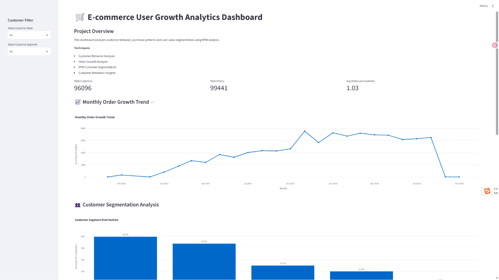

# 🛒 E-commerce User Growth Analytics Dashboard

An end-to-end customer behavior analytics project based on **Python, RFM Customer Segmentation and Streamlit Dashboard**.

This project analyzes e-commerce user purchasing behavior, identifies customer value groups, and provides business insights for customer retention and growth strategies.

---

# 📌 Project Overview

Customer growth is one of the key challenges in e-commerce businesses.

This project builds a customer analytics platform that transforms raw transaction data into actionable business insights through:

* Customer behavior analysis
* Order growth trend analysis
* RFM customer segmentation
* Customer value visualization
* Retention strategy recommendations

The final result is an interactive dashboard that helps businesses understand:

* Who are the most valuable customers?
* Which customers are at risk of churn?
* How can customer retention be improved?

---

# 🏗️ Project Architecture

```
Raw Data
    │
    ▼
Data Cleaning & Processing
    │
    ▼
RFM Feature Engineering
    │
    ▼
Customer Segmentation
    │
    ▼
Interactive Streamlit Dashboard
    │
    ▼
Business Insights
```

---

# 🛠️ Tech Stack

## Programming Language

* Python

## Data Processing

* Pandas
* NumPy

## Data Visualization

* Plotly
* Matplotlib

## Dashboard

* Streamlit

## Development Environment

* Jupyter Notebook
* VS Code

## Version Control

* Git
* GitHub

---

# 📊 Dataset

The project uses the Brazilian E-Commerce Public Dataset from Olist.

Main data sources include:

* Customer information
* Order transactions
* Product information
* Payment records
* Review information
* Seller information

The raw dataset is excluded from this repository. Only processed analytical datasets are included.

---

# 🔍 Analysis Methods

## 1. Customer Behavior Analysis

Analyzed customer purchasing behavior through:

* Purchase frequency
* Spending patterns
* Customer activity level

---

## 2. Order Growth Analysis

Analyzed monthly order trends to understand:

* Business growth patterns
* Seasonal changes
* Sales development

---

## 3. RFM Customer Segmentation

Customers are segmented using three behavioral indicators:

### Recency (R)

How recently a customer purchased.

### Frequency (F)

How often a customer purchases.

### Monetary (M)

How much a customer spends.

Based on RFM scores, customers are divided into:

| Segment            | Description                                          |
| ------------------ | ---------------------------------------------------- |
| 🏆 Champions       | High-value customers with strong purchasing behavior |
| ❤️ Loyal Customers | Regular customers with stable engagement             |
| ⚠️ At Risk         | Customers showing potential churn risk               |
| 💤 Lost Customers  | Inactive customers requiring reactivation            |

---

# 📈 Dashboard Features

## KPI Overview

Displays:

* Total Customers
* Total Orders
* Average Orders per Customer

## Monthly Order Growth Trend

Interactive visualization showing order volume changes over time.

## Customer Segmentation Analysis

Visualizes customer distribution across different RFM groups.

## Customer Value Analysis

Scatter plot showing the relationship between:

* Purchase frequency
* Customer spending

## Customer Filtering

Supports filtering customers by:

* Customer state
* Customer segment

---

# 💡 Business Insights

## 🏆 Champions Customers

Recommended actions:

* VIP membership programs
* Exclusive promotions
* Personalized recommendations

## ❤️ Loyal Customers

Recommended actions:

* Loyalty rewards
* Cross-selling strategies
* Engagement campaigns

## ⚠️ At Risk Customers

Recommended actions:

* Retention campaigns
* Personalized discounts
* Re-engagement emails

## 💤 Lost Customers

Recommended actions:

* Churn analysis
* Reactivation campaigns
* Cost-benefit evaluation

---

# 🚀 How to Run

## 1. Clone Repository

```bash
git clone https://github.com/lstuser-hash/E-commerce-User-Growth-Analytics.git
```

## 2. Install Dependencies

```bash
pip install -r requirements.txt
```

## 3. Launch Dashboard

```bash
cd dashboard

streamlit run app.py
```

---

# 📂 Project Structure

```
E-commerce-User-Growth-Analytics
│
├── dashboard
│   └── app.py
│
├── data
│   └── processed
│       └── rfm_customer_segments.csv
│
├── images
│   └── dashboard.png
│
├── notebooks
│   └── analysis.ipynb
│
├── requirements.txt
│
└── README.md
```

---

# 📷 Dashboard Preview



---

# 🎯 Future Improvements

Possible extensions:

* Customer lifetime value prediction
* Churn prediction model
* Customer recommendation system
* Geographic customer analysis
* Machine learning based segmentation

---

# 👤 Author

GitHub:
https://github.com/lstuser-hash

---

⭐ If you find this project useful, feel free to star the repository.
